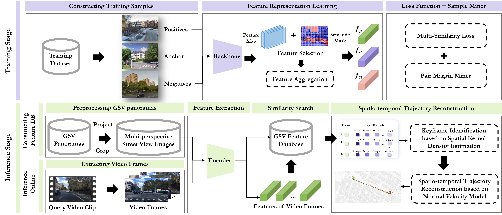
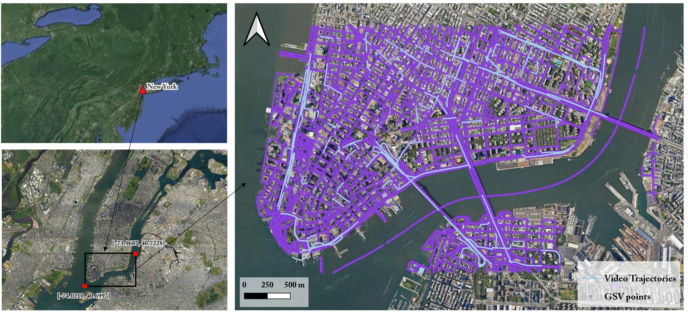
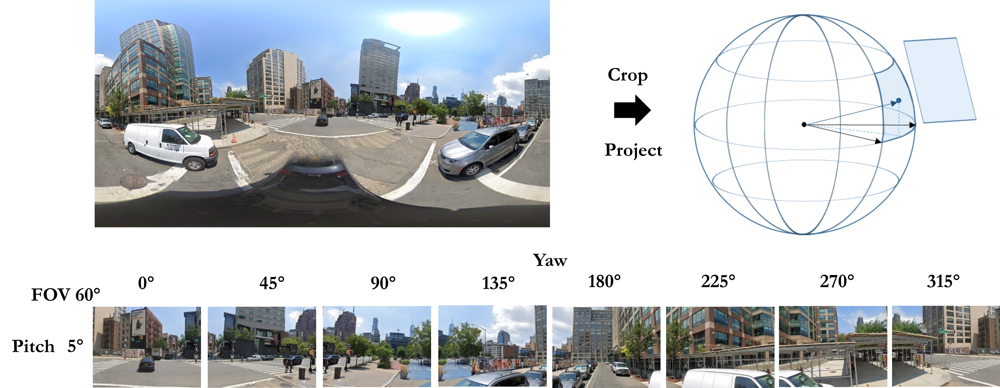
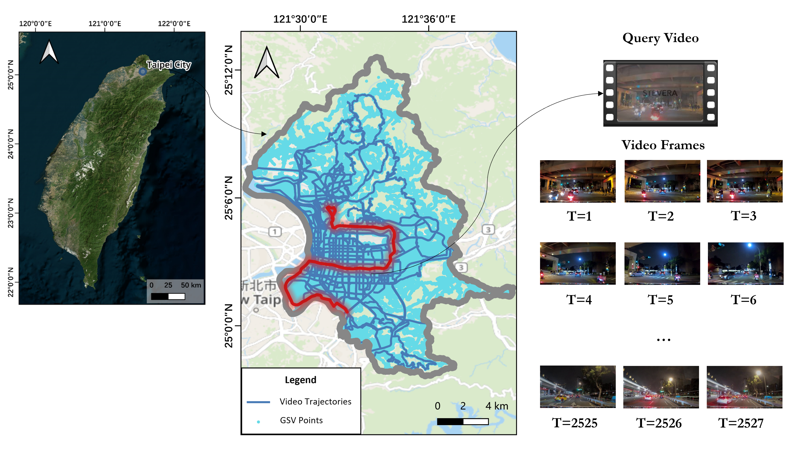

# Visual Route Recognition in Urban Spaces: A Scalable Approach Using Open Street View Data

---

> *Menglin Wu, Qingren Jia, Anran Yang, Zhinong Zhong, Mengyu Ma, Luo Chen and Ning Jing. Visual Route Recognition in Urban Spaces: A Scalable Approach Using Open Street View Data. IEEE Journal of Selected Topics in Applied Earth Observations and Remote Sensing, vol. 18, pp. 4004-4019, 2025.*

## Introduction

---

This paper presents a novel pipeline for visual route recognition (VRR) in large-scale urban environments, leveraging open street view data. The proposed approach aims to identify the path of a video recorder by analyzing visual cues from continuous video frames and street landmarks, evaluated through datasets from New York and Taipei City. The pipeline begins with SemVG (Semantic Visual Geo-localization), a semantic fused feature extraction network that filters out non-landmark noise, generating robust visual representations. We construct a feature database from multi-perspective street view images to enable efficient feature retrieval for query video frames. Additionally, we introduce a spatio-temporal trajectory reconstruction method that corrects mismatches in the camera's motion path, ensuring consistency.

For more details, check the paper [here](https://ieeexplore.ieee.org/document/10819660).



## Dataset

---

### Training and Validation Dataset

---

- For training, please download [GSV-Cities](https://github.com/amaralibey/gsv-cities) dataset. 

- For validation, please download [Pittsburgh](https://data.ciirc.cvut.cz/public/projects/2015netVLAD/Pittsburgh250k/) dataset.

### Test Dataset

---

### New York VRR Dataset
The area covered by the New York VRR Dataset is located along the southern coast of New York City, USA. It spans a longitude range of [73.9687°W, 74.0210°W] and a latitude range of [40.6997°N, 40.7228°N], encompassing a total area of approximately 13.5 km². 



The dataset contains two parts, one is the query video dataset, the other is the street view dataset for geo-reference.

>**Query Video Dataset**

The query video dataset is based on a subset of publicly available driving videos from the [BDD100K](https://github.com/bdd100k/bdd100k) dataset. The videos were filtered according to the geographic scope of the research area, resulting in 363 query videos. Each video is approximately 40 seconds long, with a resolution of 720p and a frame rate of 30fps. They also include GPS location data and timestamps recorded by a mobile phone for each video frame captured every second. These query videos were collected during different times of the day, including daytime, dusk/dawn, and nighttime, and under various weather conditions such as sunny, rainy, snowy, and foggy. The footage includes different road scenes such as residential areas, streets, and highways.
- `/bdd100k/videos:` 363 query video clips from BDD100K dataset selected by a rectangle GPS window in New York.
- `/bdd100k/info:` Video information, where the ***locations*** field contains the longitude and latitude information of video frames sampled at a rate of 1 second.
- `/bdd100k/labels:` Video labels, where the ***attributes*** field includes the weather condition, scene type, and time of day attributes for each video.

>**Street View Dataset**

The street view data is sourced from the Google Street View service platform and downloaded via [Street View Download 360](https://svd360.com/). First, panoramic images of Google Street View within the study area's spatial boundaries were scraped at a spatial sampling interval of 0.0001° (approximately 11 meters).

To avoid the effects of geometric distortions at the edges of panoramas, we cropped and projected the GSV panoramas to obtain normal perspective street view images from different angles as reference images. Each GSV panorama with size of 4096×2048 was split into 8 perspective images of 640×480 by setting the field of view (FOV) to 60°, the yaw angle interval to 45°, and the pitch angles to 5°. A total of 31,209 Google Street View panoramic images were scraped, each with a resolution of 4096×2048. After preprocessing, a set of 249,672 multi-angle perspective street view images with a resolution of 640×480 was generated for the study area.



- `/streetview/ny_pano:` Street view panoramic images and metadata.
- `/streetview/ny_persp:` Cropped street view perspective images

>**Download**

- The New York VRR Dataset can be downloaded from the [Baidu Cloud link](https://pan.baidu.com/s/1oCimsE2MsObvW-eyj-KCzQ?pwd=7qba). Please use the extraction code `7qba` to access the files.
- Put it under the `DS/` folder.

### Taipei VRR Dataset
The study area is located in Taipei City, which is in the northern part of Taiwan Island, the center of the Taipei Basin. Taipei is the largest city on the island, covering an area of 272 km².



>**Query Video Dataset**

We collected 129 street-roaming videos in Taipei City from the [YouTube platform](https://www.youtube.com/@SteveTWDrive) to build the query video dataset. Each query video is accompanied by a roaming route uploaded by the YouTube user, which consists of a set of consecutive GPS coordinates. The total duration of the collected videos is approximately 47.08 hours, covering over 1592.31 kilometers of roads. These videos cover diverse road scenes such as highways, urban streets, tunnels, intersections and curved roads. Besides, they also encounter challenging environmental variations from illumination, weather, season, perspectives, and partial occlusions. 

>**Street View Dataset**

The number of multi-perspective streetview images in Taipei is 11,630,816 in total. This extensive reference dataset ensures comprehensive coverage of the city's road network, providing a solid foundation for matching query videos with the corresponding street views.

>**Download**

- The query videos along with the routes (.gpx) can be downloaded from the [YouTube platform](https://www.youtube.com/@SteveTWDrive).
- The street view panoramic images can be downloaded from [Street View Download 360](https://svd360.com/).

### Usage Disclaimer

The data provided in this GitHub repository is intended solely for academic and research purposes. It is not authorized for commercial use or any activity that may result in financial gain. By accessing and utilizing this data, you agree to use it exclusively for educational and non-commercial purposes, in accordance with applicable academic guidelines and ethical standards. Any commercial exploitation, redistribution, or use of this data for profit is strictly prohibited.

If you have any concern, please do not hesitate to contact us ([wumenglin2022@nudt.edu.cn](wumenglin2022@nudt.edu.cn), [jiaqingrengis@nudt.edu.cn](jiaqingrengis@nudt.edu.cn)) for additional instruction to obtain the dataset used in this work.

## Train

---
For training SemVG, please modify `util/parser.py` and run:

```
python train.py
```

## Infer

---
1. Use your pretrained model weight or download our model weight from the [Baidu Cloud link](https://pan.baidu.com/s/15mvAuSuDG4dQpKbrbNLOEQ?pwd=pdzf) with the extraction code of `pdzf`. Put it under the `ckpt/` folder.
2. Extract features of the perspective street view images with `demo/feature_extractor.py`, and build the feature database. You can also download the features of the steet view images in New York VRR dataset from the [Baidu Cloud link](https://pan.baidu.com/s/1HuHNDlvN_ffTWGsXzmSWzw?pwd=yjqp) with the extraction code of `yjqp`, put it under the `demo/feature_db` folder.
3. Run `eval_videoloc.py` to obtain the predicted route of each query video.

## Evaluation

---
1. Download [C-SIM](https://github.com/uef-machine-learning/C-SIM).
2. Run `calc_indices.py`.

## Acknowledgement

---
This code is based on the amazing work of:

- [DINOv2](https://github.com/facebookresearch/dinov2)
- [GSV-Cities](https://github.com/amaralibey/gsv-cities)
- [BDD100K](https://github.com/bdd100k/bdd100k)
- [C-SIM](https://github.com/uef-machine-learning/C-SIM)
- [SteveTWDrive](https://www.youtube.com/@SteveTWDrive)

## Citation

---
If you find this repo useful for your research, please consider citing the paper:
```
@article{wu2025visual,
  title={Visual Route Recognition in Urban Spaces: A Scalable Approach Using Open Street View Data},
  author={Wu, Menglin and Jia, Qingren and Yang, Anran and Zhong, Zhinong and Ma, Mengyu and Chen, Luo and Jing, Ning},
  journal={IEEE Journal of Selected Topics in Applied Earth Observations and Remote Sensing},
  year={2025},
  publisher={IEEE}
}
```
